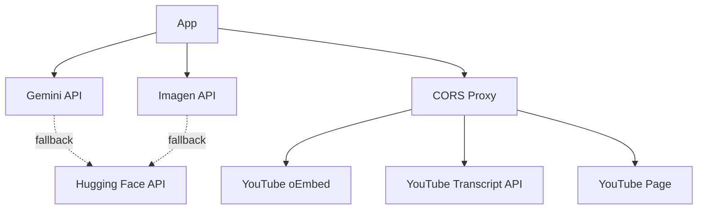

# Product Requirements Document

## Gemini Creative Suite

---

**Version:** 2.0  
**Last Updated:** November 3, 2024  
**Document Owner:** Product Engineering Team  
**Status:** Active

---

## Table of Contents

1. [Executive Summary](#1-executive-summary)
2. [Product Overview](#2-product-overview)
3. [Goals & Success Metrics](#3-goals--success-metrics)
4. [User Personas & Use Cases](#4-user-personas--use-cases)
5. [Functional Requirements](#5-functional-requirements)
6. [Technical Architecture](#6-technical-architecture)
7. [User Experience & Design](#7-user-experience--design)
8. [Data Management & Privacy](#8-data-management--privacy)
9. [Performance Requirements](#9-performance-requirements)
10. [Security & Compliance](#10-security--compliance)
11. [Error Handling & Reliability](#11-error-handling--reliability)
12. [Internationalization](#12-internationalization)
13. [Future Enhancements](#13-future-enhancements)
14. [Dependencies & External Services](#14-dependencies--external-services)
15. [Appendices](#15-appendices)

---

## 1. Executive Summary

### 1.1 Product Vision

The **Gemini Creative Suite** is a sophisticated, AI-powered web application that revolutionizes visual content creation for digital content creators. By seamlessly integrating Google's Gemini and Imagen AI models, the platform eliminates creative bottlenecks and democratizes professional-grade visual design, enabling creators to transform ideas into compelling visuals within minutes.

### 1.2 Core Value Proposition

- **Speed:** Generate production-ready visuals in under 60 seconds
- **Accessibility:** No design expertise required
- **Intelligence:** AI-driven understanding of content context
- **Multilingual:** Full Arabic and English support with RTL layout
- **Reliability:** Automatic fallback systems ensure 99%+ uptime

### 1.3 Problem Statement

Content creators face three critical challenges:
1. **Time Pressure:** Creating custom thumbnails and visual assets is time-consuming
2. **Skill Gap:** Professional design requires specialized expertise
3. **Creative Block:** Translating abstract ideas into concrete visual concepts is challenging

The Gemini Creative Suite addresses these challenges by providing AI-powered tools that understand context, generate professional designs, and provide instant visual feedback.

---

## 2. Product Overview

### 2.1 Platform Type
Single-page web application (SPA) accessible via modern browsers

### 2.2 Target Platforms
- Desktop browsers (Chrome, Firefox, Safari, Edge)
- Mobile browsers (iOS Safari, Chrome Mobile)
- Minimum viewport: 320px width

### 2.3 Core Features Summary

The application provides three primary AI-powered creative tools:

| Feature | Purpose | Primary Use Case |
|---------|---------|------------------|
| **Image Editor** | AI-driven image manipulation | Enhance or modify existing visuals |
| **YouTube Cover Generator** | Context-aware thumbnail creation | Generate video thumbnails from URLs |
| **Audio Idea Generator** | Voice-to-visual concept translation | Transform spoken ideas into visual concepts |

---

## 3. Goals & Success Metrics

### 3.1 Product Goals

**Primary Goals:**
1. **Empower Creativity:** Provide AI tools that act as creative partners, not replacements
2. **Streamline Workflow:** Reduce visual asset creation time from hours to minutes
3. **Ensure Quality:** Enable non-designers to produce professional-grade graphics
4. **Maximize Accessibility:** Support both English and Arabic-speaking creators with full localization
5. **Guarantee Reliability:** Maintain service availability through intelligent fallback mechanisms

**Secondary Goals:**
- Build user trust through transparent AI operations
- Create an intuitive, learnable interface
- Support mobile-first workflows

### 3.2 Success Metrics (KPIs)

**Engagement Metrics:**
- Average time to first successful generation: < 2 minutes
- Feature adoption rate: > 60% users try 2+ features
- Return user rate: > 40% within 7 days

**Performance Metrics:**
- Image generation success rate: > 95%
- Average generation time: < 30 seconds
- Error rate: < 5%

**Quality Metrics:**
- User satisfaction score: > 4.0/5.0
- Feature completion rate: > 80%

---

## 4. User Personas & Use Cases

### 4.1 Primary Personas

#### Persona 1: The YouTube Creator
- **Name:** Ahmed / Sarah
- **Profile:** Content creator with 10K-500K subscribers
- **Pain Points:** 
  - Needs fresh thumbnails for daily/weekly uploads
  - Limited design budget
  - Time-sensitive production schedule
- **Goals:** Create eye-catching thumbnails that increase CTR

#### Persona 2: The Podcast Host
- **Name:** Fatima / John
- **Profile:** Audio podcaster building a video presence
- **Pain Points:**
  - Transitioning from audio-only to video platforms
  - No visual design background
  - Need for consistent branding
- **Goals:** Professional cover art for each episode

#### Persona 3: The Content Strategist
- **Name:** Omar / Lisa
- **Profile:** Social media manager handling multiple accounts
- **Pain Points:**
  - High volume of content needs
  - Quick turnaround requirements
  - Multiple platform specifications
- **Goals:** Rapid prototyping and A/B testing visuals

### 4.2 Use Cases

**Use Case 1: YouTube Thumbnail Generation**
1. User pastes YouTube video URL
2. System analyzes video content (transcript/metadata)
3. AI generates culturally-relevant thumbnail
4. User downloads and uploads to YouTube
5. User reviews history for future reference

**Use Case 2: Voice Brainstorming Session**
1. User records idea brainstorming session
2. System transcribes in real-time
3. AI extracts key visual concepts
4. System generates multiple visual options
5. User selects preferred direction

**Use Case 3: Quick Image Enhancement**
1. User uploads existing thumbnail
2. User provides text instructions (e.g., "add dramatic lighting")
3. AI processes and returns enhanced version
4. User compares side-by-side and downloads

---

## 5. Functional Requirements

### 5.1 Platform-Wide Core Functionality

#### 5.1.1 Multi-Tab Interface
- **Requirement:** Three distinct tabs for each feature
- **Implementation:** React state-based tab switching
- **Behavior:** 
  - Tab state persists during session
  - Each tab maintains independent state
  - Active tab indicated with white bottom border
  - Smooth transitions between tabs

#### 5.1.2 Language Localization
- **Requirement:** Full bilingual support (Arabic/English)
- **Default Language:** Arabic (ar)
- **Supported Languages:** Arabic (ar), English (en)
- **Toggle Mechanism:** 
  - Persistent button in top-left corner
  - Single-click toggle between languages
  - Button label displays opposite language
- **RTL Support:**
  - HTML `dir` attribute updates dynamically
  - Layout adjusts for right-to-left text flow
  - All UI components respect text direction

#### 5.1.3 Responsive Design
- **Breakpoints:**
  - Mobile: 320px - 767px
  - Tablet: 768px - 1023px
  - Desktop: 1024px+
- **Layout Adaptations:**
  - Single column on mobile
  - Grid layouts on tablet/desktop
  - Touch-friendly controls on mobile

#### 5.1.4 Error Handling & User Feedback
- **Error Display:**
  - Prominent error banner below header
  - Red background with clear messaging
  - Auto-dismisses on new action
  - Errors shown in active language
- **Loading States:**
  - Spinner animations during processing
  - Step-by-step progress for multi-stage operations
  - Disabled buttons during processing

### 5.2 Feature: Image Editor

#### 5.2.1 Overview
AI-powered image editing through natural language prompts using Google's Gemini 2.5 Flash Image model.

#### 5.2.2 User Flow
```
Upload Image → Enter Edit Prompt → Process → View Comparison → Download
```

#### 5.2.3 Detailed Requirements

**Input Requirements:**

| Element | Specification | Validation |
|---------|--------------|------------|
| Image File | PNG, JPG, GIF | Max 10MB, validated client-side |
| Edit Prompt | Text string | Min 1 character, required field |
| Upload Method | File picker or drag-and-drop | Both must be supported |

**Processing Pipeline:**
1. **Client-Side:**
   - File validation (type, size)
   - Convert file to base64
   - Display preview
2. **API Call:**
   - Model: `gemini-2.5-flash-image`
   - Input: Base64 image + text prompt
   - Output modality: IMAGE
3. **Response Handling:**
   - Extract inline image data
   - Convert to data URL
   - Update UI

**Output Requirements:**
- **Display Format:** Side-by-side comparison grid
- **Original Image:** Left side (or top on mobile)
- **Edited Image:** Right side (or bottom on mobile)
- **Prompt Display:** Shown below images
- **Image Quality:** Original resolution maintained

**Edge Cases:**
- No API key: Display mock response for development
- API failure: Show clear error message
- Invalid file type: Prevent upload, show validation message
- Oversized file: Prevent upload, show size limit
- Empty prompt: Disable submit button

#### 5.2.4 Technical Specifications

```typescript
// API Endpoint
editImageWithPrompt(imageFile: File, prompt: string): Promise<string>

// Model Configuration
{
  model: 'gemini-2.5-flash-image',
  responseModalities: [Modality.IMAGE]
}
```

### 5.3 Feature: YouTube Cover Generator

#### 5.3.1 Overview
Intelligent thumbnail generation system that analyzes YouTube video content and creates contextually-relevant, professionally-designed cover art.

#### 5.3.2 User Flow
```
Enter URL → [Optional: Enable Inspiration] → Fetch Content → 
Summarize → Generate Prompt → Create Image → View Result → 
Save to History → Download
```

#### 5.3.3 Detailed Requirements

**Input Requirements:**

| Element | Specification | Validation |
|---------|--------------|------------|
| YouTube URL | Standard, short, or live URL | Regex validation for video ID |
| Inspiration Toggle | Boolean checkbox | Optional, default: false |

**Supported URL Formats:**
- Standard: `https://www.youtube.com/watch?v={videoId}`
- Short: `https://youtu.be/{videoId}`
- Live: `https://www.youtube.com/live/{videoId}`

**Processing Pipeline (4-Step Workflow):**

**Step 1: Data Fetching**
- **Primary Method:** YouTube oEmbed API for video title
  - Endpoint: `https://www.youtube.com/oembed?url={videoUrl}`
  - Data: Video title (reliable)
- **Thumbnail Fetching:** Direct URL pattern
  - URL: `https://i.ytimg.com/vi/{videoId}/maxresdefault.jpg`
  - Resolution: Maximum available
- **Description Scraping:** HTML parsing (fallback)
  - Method: Meta tag extraction or player response parsing
  - Status: Best-effort (may fail)
- **Transcript Fetching:** External API
  - API: `youtube-transcript-api.vercel.app`
  - Priority: Arabic (ar) → English (en)
  - Status: Prioritized over metadata when available

**Step 2: AI Summarization**
- **Model:** `gemini-2.5-pro`
- **Input:** Transcript (preferred) or Title + Description
- **Prompt Template:** 
  - Transcript: `/prompts/summarize_transcript.md`
  - Metadata: `/prompts/summarize_metadata.md`
- **Output:** 2-3 sentence creative brief in Arabic
- **Purpose:** Distill core visual concept

**Step 3: AI Prompt Generation**
- **Model:** `gemini-2.5-flash`
- **Input:** Arabic summary from Step 2
- **Prompt Template:** `/prompts/create_image_prompt.md`
- **Output:** Detailed English image generation prompt
- **Design Guidelines Applied:**
  - Style: Minimalist yet bold, high contrast
  - Colors: Vibrant, modern palette (gradients, duotones)
  - Composition: Dynamic, central visual metaphor
  - Restrictions: Strictly NO TEXT in image

**Step 4: AI Image Generation**

Two modes based on inspiration toggle:

**Mode A: With Inspiration** (checkbox enabled)
- **Model:** `gemini-2.5-flash-image` (multimodal)
- **Input:** 
  - Original thumbnail (base64)
  - Enhanced prompt: "Taking strong inspiration from the provided image's style, color palette, and overall composition, create a new, more dynamic and eye-catching image that visually represents: {prompt}"
- **Behavior:** Derives style from existing thumbnail

**Mode B: Without Inspiration** (default)
- **Model:** `imagen-4.0-generate-001`
- **Input:** English prompt from Step 3
- **Configuration:**
  ```typescript
  {
    numberOfImages: 1,
    outputMimeType: 'image/jpeg',
    aspectRatio: '16:9'
  }
  ```

**Output Requirements:**

**Display Card:**
- **Generated Image:** 16:9 aspect ratio, full width
- **AI Summary:** Displayed in Arabic
- **Image Prompt:** Full English prompt shown
- **Original URL:** Clickable link to source video
- **Metadata Notice:** Warning badge when using title/description (no transcript)
- **Download Button:** High contrast, prominent placement

**Generation History:**
- **Storage:** Browser localStorage
- **Persistence:** Survives page refresh
- **Display:** Reverse chronological order (newest first)
- **Data Structure:**
  ```typescript
  {
    id: string;              // ISO timestamp
    youtubeUrl: string;      // Original input
    summary: string;         // Arabic creative brief
    prompt: string;          // English image prompt
    imageUrl: string;        // Base64 data URL
    source: 'transcript' | 'metadata';  // Content source
  }
  ```
- **Interaction:** Click to expand full details

**Progress Indicators:**
- Step 1: "Fetching video data..." / "جلب بيانات الفيديو..."
- Step 2: "Summarizing with Gemini Pro..." / "التلخيص باستخدام Gemini Pro..."
- Step 3: "Creating prompt with Gemini Flash..." / "إنشاء موجه باستخدام Gemini Flash..."
- Step 4: "Generating image..." / "إنشاء الصورة..."

#### 5.3.4 Error Handling

| Error Condition | User Message | Recovery Action |
|----------------|--------------|-----------------|
| Invalid URL | "Invalid YouTube URL. Please check..." | Prompt user to verify URL |
| No video ID extracted | "Could not extract video ID" | Show URL format examples |
| Fetch failure (all methods) | "Could not fetch transcript or video details..." | Suggest checking video privacy |
| Transcript unavailable | Use metadata fallback + show notice badge | Automatic, transparent |
| API timeout | "Request timed out. Please try again." | Enable retry button |
| Image generation failure | Automatic fallback to Hugging Face | Transparent to user |

#### 5.3.5 Technical Specifications

```typescript
// Video ID Extraction
getYouTubeVideoId(url: string): string | null

// Main Pipeline
fetchYouTubeTranscript(videoId: string): Promise<{
  text: string;
  source: 'transcript' | 'metadata';
  thumbnailUrl: string | null;
}>

summarizeTranscript(content: string, source: 'transcript' | 'metadata'): Promise<string>

createImagePromptFromSummary(summary: string, useThumbnail: boolean): Promise<string>

generateImage(prompt: string, thumbnailUrl?: string | null): Promise<string>
```

### 5.4 Feature: Audio Idea Generator

#### 5.4.1 Overview
Real-time voice-to-visual concept tool that transcribes spoken brainstorming sessions and generates multiple visual concept options using Gemini Live API.

#### 5.4.2 User Flow
```
Start Recording → Speak Ideas → View Live Transcript → 
Stop Recording → AI Summarizes → Generate Visual Concepts → 
Display Results
```

#### 5.4.3 Detailed Requirements

**Input Requirements:**

| Element | Specification | Permission |
|---------|--------------|------------|
| Microphone Access | Browser MediaDevices API | Required, user-granted |
| Audio Format | PCM, 16kHz sample rate | Automatic conversion |
| Recording Duration | User-controlled | No fixed limit |

**Processing Pipeline:**

**Phase 1: Real-Time Transcription**
- **Model:** `gemini-2.5-flash-native-audio-preview-09-2025`
- **API:** Gemini Live API (WebSocket-based)
- **Process:**
  1. Request microphone permission
  2. Create AudioContext (16kHz sample rate)
  3. Establish Live API session
  4. Stream audio chunks via ScriptProcessorNode
  5. Receive transcription updates in real-time
  6. Append transcript segments to display
- **UI Behavior:**
  - Record button changes to pulsing red square (stop icon)
  - Transcript appears character-by-character
  - Placeholder text: "Speak now... transcript will appear here"

**Phase 2: Post-Recording Processing**

After user stops recording:

1. **AI Summarization**
   - **Model:** `gemini-2.5-pro`
   - **Input:** Full transcript
   - **Prompt Template:** `/prompts/summarize_audio.md`
   - **Output:** 2-3 sentence creative brief in Arabic
   - **Purpose:** Extract core visual idea

2. **AI Prompt Generation**
   - **Model:** `gemini-2.5-flash`
   - **Input:** Arabic summary
   - **Prompt Template:** `/prompts/create_image_prompt.md`
   - **Output:** English image generation prompt

3. **AI Image Generation**
   - **Model:** `imagen-4.0-generate-001`
   - **Count:** 2 distinct images
   - **Configuration:**
     ```typescript
     {
       numberOfImages: 2,
       outputMimeType: 'image/jpeg',
       aspectRatio: '16:9'
     }
     ```

**Output Requirements:**

**Live Transcript Display:**
- **Container:** Fixed height (128px), scrollable
- **Background:** Semi-transparent dark
- **Behavior:** Auto-scroll to bottom as new text arrives
- **Text Color:** Light red for readability

**Results Display:**
- **Idea Summary:** Displayed in Arabic in prominent card
- **Visual Ideas:** Two images in responsive grid
  - Desktop: 2 columns
  - Mobile: 1 column, stacked
- **Image Prompt:** Shown below images in italic text
- **Quality:** Full 16:9 aspect ratio maintained

**Recording Controls:**

| State | Button Appearance | Icon | Action |
|-------|------------------|------|--------|
| Idle | White circle | Microphone | Start recording |
| Recording | Red pulsing circle | Stop square | Stop recording |
| Processing | Disabled | Spinner | Wait for results |

**Button Specifications:**
- Size: 96px × 96px circular
- Position: Centered in container
- Animation: Pulse effect when recording
- Shadow: Prominent drop shadow
- Focus ring: 4px white/50% opacity

#### 5.4.4 Audio Processing Technical Details

**Audio Configuration:**
```typescript
AudioContext: {
  sampleRate: 16000,  // Required by Gemini Live API
}

ScriptProcessorNode: {
  bufferSize: 4096,
  inputChannels: 1,
  outputChannels: 1
}
```

**PCM Encoding:**
```typescript
// Convert Float32Array to Int16Array PCM
const int16 = new Int16Array(audioData.length);
for (let i = 0; i < audioData.length; i++) {
  int16[i] = audioData[i] * 32768;
}

// Create Gemini-compatible blob
const blob: Blob = {
  data: base64Encode(int16),
  mimeType: 'audio/pcm;rate=16000'
}
```

**Live API Session:**
```typescript
ai.live.connect({
  model: 'gemini-2.5-flash-native-audio-preview-09-2025',
  callbacks: {
    onopen: () => console.log("Session opened"),
    onmessage: (msg) => {
      if (msg.serverContent?.inputTranscription) {
        updateTranscript(msg.serverContent.inputTranscription.text);
      }
    },
    onerror: (e) => handleError(e),
    onclose: () => cleanup()
  },
  config: {
    responseModalities: [Modality.AUDIO],
    inputAudioTranscription: {}
  }
})
```

#### 5.4.5 Session Management

**Starting Recording:**
1. Request microphone permission
2. Create audio context and nodes
3. Connect audio processing pipeline
4. Establish Live API session
5. Start streaming audio chunks

**Stopping Recording:**
1. Stop all media tracks
2. Disconnect audio nodes
3. Close audio context
4. Close Live API session
5. Clean up references
6. Trigger post-processing

**Cleanup Requirements:**
- All resources must be released
- Memory leaks prevented
- Session state reset for next recording

#### 5.4.6 Error Handling

| Error Condition | User Message | Recovery Action |
|----------------|--------------|------------------|
| No microphone permission | "Could not start recording. Check permissions." | Show browser permission instructions |
| Microphone not found | "No microphone detected." | Prompt user to connect device |
| API connection failure | "Connection error. Please retry." | Enable retry button |
| Transcription timeout | "Transcription service unavailable." | Allow manual text entry |
| Empty transcript | N/A | Prevent processing, button disabled |
| Image generation failure | Fallback to Hugging Face | Transparent to user |

#### 5.4.7 Technical Specifications

```typescript
// Core Functions
startTranscription(onTranscriptUpdate: (text: string) => void): Promise<void>
stopTranscription(): void
summarizeAudioTranscript(transcript: string): Promise<string>
generateImagesFromPrompt(prompt: string, count: number): Promise<string[]>

// State Management
const [isRecording, setIsRecording] = useState<boolean>(false);
const [liveTranscript, setLiveTranscript] = useState<string>('');
const transcriptRef = useRef<string>('');  // Persistent across renders
```

---

## 6. Technical Architecture

### 6.1 Frontend Stack

#### 6.1.1 Core Technologies

| Technology | Version | Purpose |
|-----------|---------|---------|
| React | 19.2.0 | UI framework |
| TypeScript | ~5.8.2 | Type safety |
| Vite | ^6.2.0 | Build tool & dev server |
| Tailwind CSS | CDN (latest) | Styling framework |

#### 6.1.2 State Management
- **Pattern:** React Hooks
- **Hooks Used:**
  - `useState`: Component state
  - `useEffect`: Side effects, lifecycle
  - `useCallback`: Memoized callbacks
  - `useRef`: Persistent values, DOM refs
- **No External State Library:** Intentional decision for simplicity

#### 6.1.3 Styling Architecture

**Tailwind Configuration:**
```javascript
{
  theme: {
    extend: {
      fontFamily: {
        sans: ['Tajawal', 'sans-serif']
      },
      colors: {
        'brand-red': {
          100: '#fce9e9',  // Lightest
          200: '#f7c8c9',
          300: '#f0a7a9',
          400: '#e98688',
          500: '#c0282c',  // Brand primary
          600: '#a82327',
          700: '#901e21',
          800: '#78191c',
          900: '#601416'   // Darkest
        }
      }
    }
  }
}
```

**Design Tokens:**
- Primary: `brand-red-500` (#c0282c)
- Dark backgrounds: `brand-red-800` to `brand-red-900`
- Light text: `red-100` to `red-200`
- Interactive elements: White text on dark, dark text on white

### 6.2 AI Services Architecture

#### 6.2.1 Google Gemini Integration

**SDK:** `@google/genai` v1.27.0

**Models Used:**

| Model ID | Purpose | Input | Output |
|----------|---------|-------|--------|
| gemini-2.5-flash-image | Image editing & inspired generation | Image + Text | Image |
| gemini-2.5-pro | Summarization (high quality) | Text | Text |
| gemini-2.5-flash | Prompt generation (fast) | Text | Text |
| imagen-4.0-generate-001 | Image generation (text-only) | Text | Image |
| gemini-2.5-flash-native-audio-preview-09-2025 | Live transcription | Audio stream | Text stream |

**Configuration:**
```typescript
const ai = new GoogleGenAI({ 
  apiKey: process.env.API_KEY 
});
```

**API Key Management:**
- **Source:** Environment variable `API_KEY`
- **Security:** Never exposed to client
- **Validation:** Checked before each API call
- **Fallback:** Mock responses for development

#### 6.2.2 Prompt Management System

**Architecture:** Externalized prompts in `/prompts` directory

**Benefits:**
- Decouples prompt engineering from code
- Version control for prompts
- Easy iteration without deployments
- Content-level A/B testing

**Prompt Files:**

| File | Purpose | Model | Language |
|------|---------|-------|----------|
| `summarize_transcript.md` | Summarize YouTube transcripts | gemini-2.5-pro | Output: Arabic |
| `summarize_metadata.md` | Summarize video title/description | gemini-2.5-pro | Output: Arabic |
| `summarize_audio.md` | Summarize voice brainstorms | gemini-2.5-pro | Output: Arabic |
| `create_image_prompt.md` | Generate English image prompts | gemini-2.5-flash | Output: English |

**Prompt Loading:**
```typescript
const promptCache = new Map<string, string>();

const fetchPrompt = async (name: string): Promise<string> => {
  if (promptCache.has(name)) return promptCache.get(name)!;
  
  const response = await fetch(`/prompts/${name}.md`);
  const text = await response.text();
  promptCache.set(name, text);
  return text;
}
```

**Template Variables:**
- `{content}`: Source text to process
- `{summary}`: Arabic summary for image prompt generation
- `{inspiration_text}`: Conditional text for inspiration mode

#### 6.2.3 Fallback System

**Primary Provider:** Google Gemini/Imagen  
**Fallback Provider:** Hugging Face Inference API

**Fallback Model:** `stabilityai/stable-diffusion-xl-base-1.0`

**Trigger Conditions:**
- Gemini/Imagen API failure
- Network timeout
- Rate limiting
- Model unavailability

**Implementation:**
```typescript
try {
  return await generateWithGemini(prompt);
} catch (geminiError) {
  console.warn("Falling back to Hugging Face");
  return await generateImagesWithHuggingFace(prompt, count);
}
```

**Limitations:**
- Hugging Face free tier: slower, cold starts
- No API token: subject to rate limits
- No fallback for editing or transcription

### 6.3 External Services & APIs

#### 6.3.1 CORS Proxy

**Service:** `api.allorigins.win`  
**Purpose:** Bypass CORS restrictions for YouTube data fetching  
**Pattern:** `https://api.allorigins.win/raw?url={encodedUrl}`

**Used For:**
- YouTube oEmbed API calls
- Video page scraping
- Thumbnail fetching

**Reliability:** Third-party service, no SLA

#### 6.3.2 YouTube Data Services

**YouTube oEmbed API:**
- **Endpoint:** `https://www.youtube.com/oembed?url={videoUrl}&format=json`
- **Purpose:** Reliable video title fetching
- **Rate Limits:** Unlimited (no auth required)
- **Data:** Video title, author name

**YouTube Thumbnail CDN:**
- **Pattern:** `https://i.ytimg.com/vi/{videoId}/maxresdefault.jpg`
- **Purpose:** High-res thumbnail images
- **Fallback:** `hqdefault.jpg` if maxresdefault not available

**YouTube Transcript API:**
- **Service:** `youtube-transcript-api.vercel.app`
- **Endpoint:** `/?video_id={videoId}&lang={lang}`
- **Languages Tried:** Arabic (ar) → English (en)
- **Reliability:** Best-effort, many videos lack transcripts
- **Response Format:** JSON array of `{ text: string }` objects

#### 6.3.3 Service Dependencies



### 6.4 Data Flow Architecture

#### 6.4.1 Image Editor Flow
```
User Upload → File Validation → Base64 Conversion → 
Gemini Flash Image API → Response Parsing → UI Update
```

#### 6.4.2 YouTube Generator Flow
```
URL Input → Video ID Extraction → 
[Parallel: Transcript Fetch + Metadata Fetch] →
Content Priority (Transcript > Metadata) →
Gemini Pro Summarization →
Gemini Flash Prompt Generation →
[If Inspiration: Gemini Flash Image | Else: Imagen] →
Result Display → LocalStorage Save
```

#### 6.4.3 Audio Generator Flow
```
Mic Permission → Audio Context Setup →
Live API Connection → Audio Streaming →
Real-time Transcription Display →
User Stop → Session Close →
Gemini Pro Summarization →
Gemini Flash Prompt Generation →
Imagen Batch Generation (2 images) →
Results Display
```

### 6.5 Build & Deployment

#### 6.5.1 Build Configuration

**Build Tool:** Vite 6.2.0

**Build Command:** `npm run build`

**Output:**
```
dist/
├── index.html
├── assets/
│   └── index-[hash].js
└── prompts/
    └── *.md
```

**Optimizations:**
- Code splitting by route
- Tree shaking
- Minification
- Gzip compression

#### 6.5.2 Development Server

**Command:** `npm run dev`  
**Port:** 5173 (default)  
**Features:**
- Hot Module Replacement (HMR)
- Fast refresh
- Source maps

#### 6.5.3 Environment Variables

**Required:**
- `API_KEY`: Google Gemini API key

**Configuration File:** `.env.local`

```bash
API_KEY=your_gemini_api_key_here
```

**Vite Integration:**
```typescript
import.meta.env.API_KEY
// Replaced with process.env.API_KEY by build
```

### 6.6 Browser Compatibility

**Minimum Versions:**
- Chrome/Edge: 90+
- Firefox: 88+
- Safari: 14+
- iOS Safari: 14+
- Chrome Mobile: 90+

**Required APIs:**
- ES2020 features
- Web Audio API
- MediaDevices API
- FileReader API
- LocalStorage API
- Fetch API
- ImportMaps

---

## 7. User Experience & Design

### 7.1 Design System

#### 7.1.1 Visual Theme

**Aesthetic:** Dark, modern, professional

**Color Strategy:**
- **Background:** Radial gradient from `brand-red-700` to `brand-red-900`
- **Containers:** `brand-red-800/60` with backdrop blur
- **Borders:** `brand-red-600` for subtle separation
- **Text:** White primary, `red-100` to `red-200` for secondary
- **Accents:** White for CTAs, creating high contrast

**Typography:**
- **Primary Font:** Tajawal (Google Fonts)
- **Purpose:** Optimized for Arabic display
- **Weights:** 400 (Regular), 500 (Medium), 700 (Bold)
- **Fallback:** System sans-serif

#### 7.1.2 Component Patterns

**Buttons:**
- **Primary CTA:** White background, dark text, hover: `red-100`
- **Size:** Full width on mobile, auto on desktop
- **Height:** 48px (3rem) for touch accessibility
- **State:** Disabled state with reduced opacity
- **Loading:** Inline spinner replaces text

**Input Fields:**
- **Background:** `brand-red-900`
- **Border:** `brand-red-600`, white on focus
- **Focus Ring:** 2px white ring
- **Placeholder:** `red-200/50` opacity

**Cards:**
- **Background:** `brand-red-800/60` with blur
- **Border:** `brand-red-600`
- **Padding:** 24px-32px responsive
- **Shadow:** Large, layered shadow for depth
- **Hover:** Subtle scale/shadow transition

**File Uploader:**
- **Idle:** Dashed border, upload icon, instruction text
- **Hover:** Background darkens slightly
- **With File:** Image preview fills container
- **Drag Active:** Border color changes, background highlights

### 7.2 Interaction Design

#### 7.2.1 Feedback Mechanisms

**Loading States:**
- **Spinner:** Rotating ring animation
- **Text:** Contextual message ("Generating...", "Processing...")
- **Progress Steps:** YouTube generator shows 1/4, 2/4, 3/4, 4/4
- **Duration:** Average 20-30 seconds per operation

**Success States:**
- **Animation:** Fade-in transition for results
- **Visual Hierarchy:** Generated content emphasized
- **Actions:** Clear download/save options

**Error States:**
- **Banner:** Top of active tab, red background
- **Icon:** Error icon for visual clarity
- **Message:** Clear, actionable language
- **Dismissal:** Auto-dismiss on new action

#### 7.2.2 Micro-Interactions

**Tab Switching:**
- **Animation:** 300ms ease-in-out
- **Indicator:** Bottom border slides smoothly
- **Content:** Cross-fade between tabs

**Button Hover:**
- **Scale:** Subtle scale(1.02)
- **Shadow:** Shadow expansion
- **Duration:** 200ms transition

**Record Button:**
- **Idle → Recording:** Color shift, scale pulse
- **Recording:** Continuous pulse animation
- **Stop:** Icon change (microphone → square)

**Image Reveal:**
- **Animation:** Fade-in over 500ms
- **Scale:** Slight scale-up effect
- **Easing:** Ease-out for smooth entry

### 7.3 Responsive Behavior

#### 7.3.1 Mobile (320px - 767px)

**Layout:**
- Single column
- Full-width components
- Stacked images
- Larger touch targets (min 44px)

**Typography:**
- Base: 16px
- Headings: Reduced scale
- Line height: 1.5 for readability

**Navigation:**
- Tabs: Horizontal scroll if needed
- Tab labels: Full text visible

#### 7.3.2 Tablet (768px - 1023px)

**Layout:**
- 2-column grid for forms
- Side-by-side image comparison
- Moderate spacing

#### 7.3.3 Desktop (1024px+)

**Layout:**
- Centered container, max 896px (4xl)
- Generous whitespace
- Side-by-side comparisons
- Multi-column history

### 7.4 Accessibility

#### 7.4.1 Keyboard Navigation
- All interactive elements focusable
- Visible focus indicators
- Logical tab order
- Enter/Space activates buttons

#### 7.4.2 Screen Readers
- Semantic HTML elements
- `aria-label` on icon-only buttons
- `alt` text on images
- Status announcements for async operations

#### 7.4.3 Color Contrast
- All text meets WCAG AA standards
- Minimum 4.5:1 contrast ratio
- Error states use both color and text

#### 7.4.4 RTL Support
- Automatic layout mirroring
- Text alignment respects direction
- Icons and images positioned correctly

---

## 8. Data Management & Privacy

### 8.1 Data Storage

#### 8.1.1 LocalStorage Usage

**Purpose:** Generation history persistence

**Data Stored:**
```typescript
{
  key: 'generationHistory',
  value: JSON.stringify([
    {
      id: '2024-11-03T12:00:00.000Z',
      youtubeUrl: 'https://youtube.com/watch?v=abc123',
      summary: 'ملخص الفيديو...',
      prompt: 'A vibrant, modern...',
      imageUrl: 'data:image/jpeg;base64,...',
      source: 'transcript'
    },
    // ... more items
  ])
}
```

**Capacity:** Typically 5-10MB browser limit  
**Lifecycle:** Persists until user clears browser data  
**Management:** No automatic expiration

#### 8.1.2 Data Not Stored

**Session-Only Data:**
- Audio recordings (immediately processed, not saved)
- Uploaded images (only in memory during session)
- API keys (environment variables only)
- User identity (no user accounts)

### 8.2 Privacy Considerations

#### 8.2.1 User Data Handling

**Principle:** Minimal data collection

**Data Processing:**
- All AI processing on external servers (Google, Hugging Face)
- Images and transcripts sent to AI providers
- No analytics or tracking implemented
- No cookies set

**Third-Party Data Sharing:**
- Google Gemini API: Receives images, text, audio
- Hugging Face API: Receives text prompts (fallback only)
- YouTube Services: Receives video IDs for metadata fetch

#### 8.2.2 YouTube Content

**Fair Use:**
- App fetches publicly available metadata
- Transcripts accessed via public APIs
- No content redistribution
- Generated images are transformative use

### 8.3 Security Considerations

**API Key Security:**
- Stored in environment variables
- Never exposed in client code
- Validated server-side

**Input Validation:**
- File type checking
- File size limits
- URL format validation
- XSS prevention through React escaping

**CORS Handling:**
- Third-party proxy for necessary endpoints
- No direct cross-origin requests

---

## 9. Performance Requirements

### 9.1 Performance Targets

| Metric | Target | Measurement |
|--------|--------|-------------|
| Initial Page Load | < 3s | Time to Interactive (TTI) |
| Image Editor Response | < 15s | API call + render |
| YouTube Cover Generation | < 45s | Full pipeline |
| Audio Transcription | < 100ms delay | Real-time latency |
| Audio Processing | < 30s | Post-recording |

### 9.2 Optimization Strategies

#### 9.2.1 Code Splitting
- Lazy load components per tab
- Dynamic imports for heavy libraries

#### 9.2.2 Image Handling
- Base64 encoding for transport
- Data URLs for display
- No redundant re-encoding

#### 9.2.3 API Optimization
- Prompt caching (Map-based)
- Parallel API calls where possible
- Connection pooling (native fetch)

#### 9.2.4 State Management
- useCallback for stable references
- useRef for non-render-critical data
- Minimize re-renders

### 9.3 Performance Monitoring

**Metrics to Track:**
- API response times
- Error rates by feature
- Fallback trigger frequency
- localStorage size

---

## 10. Security & Compliance

### 10.1 Security Measures

#### 10.1.1 Input Sanitization
- File type whitelist enforcement
- URL validation with regex
- Text input length limits
- React's built-in XSS protection

#### 10.1.2 API Security
- Environment variable isolation
- No hardcoded credentials
- API key rotation capability

#### 10.1.3 Content Security
- No inline JavaScript execution
- Trusted sources only (CDNs, own domain)
- Base64 encoding for data transport

### 10.2 Compliance

**GDPR Considerations:**
- No personal data collected
- No user tracking
- Data processing for service delivery only
- User can clear localStorage manually

**Content Guidelines:**
- No moderation layer (relies on Gemini's safety filters)
- Users responsible for content rights

---

## 11. Error Handling & Reliability

### 11.1 Error Categories

#### 11.1.1 User Input Errors
- **Invalid file type:** Prevent upload, show format list
- **Oversized file:** Prevent upload, show size limit
- **Invalid URL:** Show format examples
- **Empty required fields:** Disable submit, show validation

#### 11.1.2 API Errors
- **Network failure:** "Network error. Check connection."
- **API timeout:** "Request timed out. Please retry."
- **Rate limiting:** "Service busy. Try again shortly."
- **Invalid response:** "Unexpected response. Please retry."

#### 11.1.3 System Errors
- **Microphone access denied:** Show permission instructions
- **LocalStorage full:** "Storage full. Clear history."
- **Browser incompatibility:** "Browser not supported. Use latest Chrome/Firefox."

### 11.2 Fallback Mechanisms

**Image Generation:**
1. Try Gemini/Imagen (primary)
2. Fall back to Hugging Face
3. Show error if both fail

**YouTube Data:**
1. Try transcript (Arabic)
2. Try transcript (English)
3. Fall back to title + description
4. Show error if all fail

**Audio Transcription:**
- No fallback (Live API only)
- Show error with retry option

### 11.3 Reliability Features

**Retry Logic:**
- User-initiated retry (button)
- No automatic retries (to avoid quota waste)

**Graceful Degradation:**
- History loads even if localStorage corrupt
- App functions without API key (mock mode for dev)

**State Recovery:**
- Generation history survives page refresh
- Tab state persists during session

---

## 12. Internationalization

### 12.1 Supported Languages

**Current:** Arabic (ar), English (en)  
**Default:** Arabic (ar)

### 12.2 Translation Architecture

**Implementation:** Object-based translations in `App.tsx`

```typescript
const translations = {
  ar: { /* Arabic strings */ },
  en: { /* English strings */ }
};

const t = translations[language];
```

**Coverage:** 100% of UI text

**Dynamic Updates:**
- Language toggle updates all text instantly
- No page reload required
- RTL layout switches automatically

### 12.3 RTL Support

**HTML Attributes:**
```typescript
document.documentElement.lang = language;
document.documentElement.dir = language === 'ar' ? 'rtl' : 'ltr';
```

**Layout Impact:**
- Text alignment
- Flexbox direction
- Grid column order
- Padding/margin logical properties

**Components:**
- All text respects direction
- Icons maintain position
- Forms align correctly

### 12.4 Cultural Adaptation

**Arabic-First Design:**
- Tajawal font optimized for Arabic
- Default language reflects target audience
- AI summaries generated in Arabic

**English Support:**
- Full feature parity
- Professional translations
- Western reading patterns

---

## 13. Future Enhancements

### 13.1 Planned Features

**Phase 2:**
- Batch processing (multiple URLs)
- Custom style presets
- Image history with search
- Export to multiple formats
- Template library

**Phase 3:**
- User accounts & cloud storage
- Collaboration features
- Brand kit customization
- Analytics dashboard
- API for third-party integration

### 13.2 Technical Debt

**Current Limitations:**
- No automated tests
- No CI/CD pipeline
- No error tracking service
- No performance monitoring
- No A/B testing framework

**Recommended Improvements:**
- Add Jest + React Testing Library
- Set up GitHub Actions
- Integrate Sentry or similar
- Add performance monitoring
- Implement feature flags

---

## 14. Dependencies & External Services

### 14.1 NPM Dependencies

```json
{
  "dependencies": {
    "@google/genai": "^1.27.0",
    "react": "^19.2.0",
    "react-dom": "^19.2.0"
  },
  "devDependencies": {
    "@types/node": "^22.14.0",
    "@vitejs/plugin-react": "^5.0.0",
    "typescript": "~5.8.2",
    "vite": "^6.2.0"
  }
}
```

### 14.2 CDN Dependencies

- **Tailwind CSS:** `https://cdn.tailwindcss.com`
- **Google Fonts (Tajawal):** `https://fonts.googleapis.com`
- **@google/genai (import map):** `https://aistudiocdn.com`

### 14.3 External Service Status

| Service | Criticality | Has Fallback | SLA |
|---------|-------------|--------------|-----|
| Google Gemini API | Critical | Partial (HF for images) | None (free tier) |
| Hugging Face API | Fallback | No | None (free tier) |
| YouTube oEmbed | High | No | Unknown |
| Transcript API | Medium | Yes (metadata) | Unknown |
| CORS Proxy | Medium | No | Unknown |

### 14.4 Vendor Lock-In Analysis

**High Dependency:**
- Google Gemini: Core functionality
- React: UI framework

**Mitigation:**
- Abstractions for AI calls
- Component-based architecture
- Fallback providers where possible

---

## 15. Appendices

### 15.1 Glossary

**Terms:**
- **Cover Art:** YouTube thumbnail or podcast episode image
- **Creative Brief:** 2-3 sentence summary in Arabic describing visual concept
- **Inspiration Mode:** Using existing thumbnail to guide new generation
- **Metadata:** Video title and description when transcript unavailable
- **Prompt:** Text instruction for AI model

### 15.2 URL Patterns

**YouTube URL Formats:**
```
Standard: https://www.youtube.com/watch?v=VIDEO_ID
Short:    https://youtu.be/VIDEO_ID
Live:     https://www.youtube.com/live/VIDEO_ID
Embedded: https://www.youtube.com/embed/VIDEO_ID
```

**Regex:**
```regex
/(?:youtube\.com\/(?:[^\/]+\/.+\/|(?:v|e(?:mbed)?)\/|.*[?&]v=)|youtu\.be\/|youtube\.com\/live\/)([a-zA-Z0-9_-]{11})/
```

### 15.3 Model Specifications

**Gemini 2.5 Flash Image:**
- Input: Image (base64) + Text
- Output: Image
- Max Image Size: ~10MB
- Response Time: 10-20s

**Gemini 2.5 Pro:**
- Input: Text (up to ~1M tokens)
- Output: Text
- Response Time: 5-10s

**Gemini 2.5 Flash:**
- Input: Text
- Output: Text
- Response Time: 2-5s
- Use Case: Fast prompt generation

**Imagen 4.0:**
- Input: Text prompt
- Output: 1-8 images
- Aspect Ratios: 1:1, 16:9, 9:16, 4:3, 3:4
- Quality: High
- Response Time: 15-25s

**Gemini 2.5 Flash Native Audio:**
- Input: PCM audio stream (16kHz)
- Output: Real-time text transcription
- Latency: < 100ms

### 15.4 Prompt Engineering Guidelines

**Effective Prompts:**
- Clear, specific instructions
- Context about target audience
- Style guidelines (colors, composition)
- Restrictions (e.g., "no text")
- Output language specification

**Example (from `create_image_prompt.md`):**
```markdown
Generate a visually striking and modern prompt in ENGLISH for a YouTube podcast cover, based on the following creative brief.

**AESTHETIC GUIDELINES:**
- **Style:** Minimalist yet bold, clean graphic design, high contrast.
- **Colors:** Use a vibrant, modern color palette. Consider gradients, duotones, or electric hues.
- **Composition:** Dynamic and eye-catching. Focus on a central, powerful visual metaphor that grabs attention.
- **Elements:** Strictly **NO TEXT**.

**CREATIVE BRIEF (ARABIC):**
"{summary}"
```

### 15.5 Browser Storage Limits

**LocalStorage:**
- Chrome: 10MB
- Firefox: 10MB
- Safari: 5MB
- Edge: 10MB

**Capacity Planning:**
- Average history item: ~500KB (with base64 image)
- Max items before limit: ~10-20 entries
- No automatic cleanup implemented

### 15.6 Accessibility Checklist

- [x] Keyboard navigation
- [x] Focus indicators
- [x] Semantic HTML
- [x] Alt text on images
- [x] Color contrast (WCAG AA)
- [x] RTL support
- [ ] Screen reader testing (not formally tested)
- [ ] ARIA live regions (partially implemented)

### 15.7 Change Log

| Version | Date | Changes |
|---------|------|---------|
| 2.0 | Nov 3, 2024 | Complete PRD overhaul: added technical details, expanded all sections, standardized formatting |
| 1.0 | Oct 26, 2023 | Initial PRD creation |

---

**Document End**
